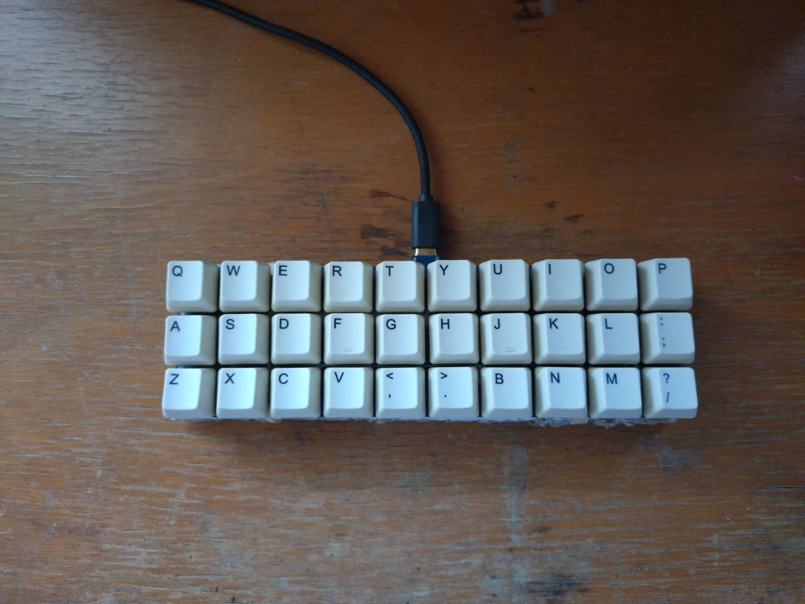

# Wahoo!
---
a totally not gherkin based off the CH552T microcontroller and [FAK firmware](https://github.com/semickolon/fak)

all of the files needed to produce the pcb should be here.

for compiling and flashing the firmware just copy the provided `.ncl` files into the ncl/ directory when following the FAK flashing guide (available [here](https://github.com/semickolon/fak/blob/main/README.md))

big shout outs to semickolon and apfel from the FAK discord!
